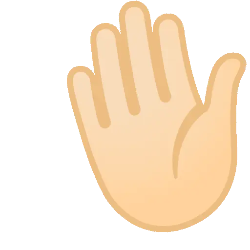

  

<h1>Hi, I'm Karla — Frontend / UI Engineer</h1>

I build clear, usable interfaces for real products. 
My work sits between <strong>frontend engineering, UI, and product</strong> — from individual interactions to complete flows and the systems behind them.

  
  
  
  
  

<h2>What I do</h2>

I've been building for the web since 2019, mostly on the frontend.
I've worked on production software in <strong>travel and corporate gifting</strong>, including booking flows, catalogs, checkout experiences, internal tools, and reusable UI.

I care about what happens between one screen and the next: how a flow is structured, what the user needs to understand, and how the frontend can make that process simpler.

<ul>
  <li><strong>UI engineering</strong> — clear, responsive, accessible interfaces</li>
  <li><strong>Product flows</strong> — thinking beyond isolated screens</li>
  <li><strong>Frontend architecture</strong> — reusable components, sensible boundaries, maintainable code</li>
  <li><strong>Usability</strong> — reducing friction and making interactions easier to understand</li>
</ul>

<blockquote>
Clear interfaces are part of the functionality.
</blockquote>

<h2>Currently building</h2>

<h3>English Journal</h3>

A personal English-learning platform built around spaced repetition, structured content, vocabulary practice, phonetics, pronunciation, and progress tracking.

It also includes AI-assisted conversation and pronunciation exercises using Gemini.
The project has become my main playground for exploring <strong>Supabase, backend development, application architecture, and larger product decisions</strong>.

Built with <strong>Next.js, TypeScript, Supabase, Dexie, and the Gemini API</strong>.

<h3>Craftie</h3>

A color and typography tool for exploring palettes, accessibility, font pairings, and lightweight brand systems.
It uses OKLCH color spaces, WCAG contrast checks, and image-based palette generation.

<h3>SVGify</h3>

A browser-based SVG vectorization tool that processes images entirely on the client using Web Workers — no uploads and no server-side image processing.

Built with <strong>Next.js and TypeScript</strong>, with an emphasis on clear architecture and keeping browser-specific logic isolated.

<h2>Stack</h2>

<strong>Core</strong> — HTML · CSS · JavaScript · TypeScript

<strong>Frontend</strong> — React · Next.js · Tailwind CSS

<strong>Backend & Data</strong> — Supabase · PostgreSQL · Row-Level Security

<strong>Testing</strong> — Vitest · React Testing Library · Playwright

<strong>Tools</strong> — Git · Figma · Claude · Gemini

<h2>What I'm exploring</h2>

I'm gradually expanding beyond the frontend into <strong>backend development, application architecture, and React Native</strong>.

AI is also part of my daily development workflow for implementation, debugging, research, and prototyping. I'm interested in using it where it genuinely improves the product rather than treating it as the product itself.

<h2>Open to</h2>

Frontend and UI engineering roles where I can work close to the product, solve real interface problems, and contribute beyond isolated tickets.

<h2>Contact</h2>

  
  

